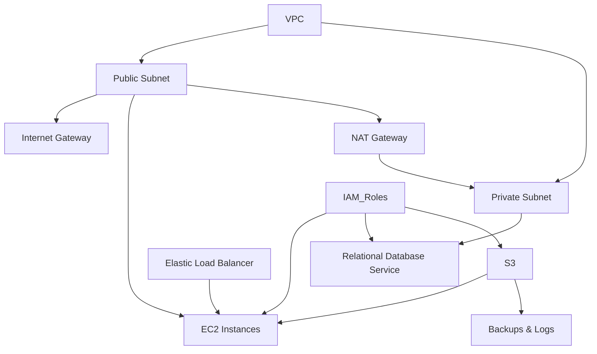

# IronHack Lab-10

## Code Analysis and Optimizations

```mermaid
graph TD
    VPC[VPC] --> Public_Subnet[Public Subnet]
    VPC --> Private_Subnet[Private Subnet]
    Public_Subnet --> IGW[Internet Gateway]
    Public_Subnet --> EC2[EC2 Instances]
    Private_Subnet --> RDS[Relational Database Service]
    Public_Subnet --> NAT[NAT Gateway]
    NAT --> Private_Subnet
    ELB[Elastic Load Balancer] --> EC2
    S3 --> EC2
    S3 --> Backups[Backups & Logs]
    IAM_Roles --> EC2
    IAM_Roles --> RDS
    IAM_Roles --> S3
```
